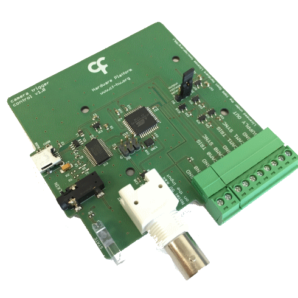

## Harp Camera Trigger Control

This device allows to trigger up to 2 cameras at a predefined frequency pulse or 2 servo motors. Connect cameras to CAM0 TRIG and CAM1 TRIG ports.

### Key Features ###

* Separate sample frequency for each camera
* Alternate between camera triggering and servo motor control
* Each camera output can be handled as pure digital output

### Connectivity ###

* 1x clock sync input (CLKIN) [stereo jack]
* 1x USB (for computer) [USB type B]
* 1x 5V supply out [screw terminal]
* 4x digital outputs (I/O interface for 2 cameras): CAM0 TRIG, CAM0 SYNC, CAM1 TRIG, CAM1 SYNC [screw terminal]
* 1x digital input for general purpose or camera control (IN0) [BNC]

## Interface ##

The interface with the Harp board can be done through [Bonsai](https://bonsai-rx.org/) or a dedicated GUI (Graphical User Interface).

In order to use this GUI, there are some software that needs to be installed:

1 - Install the [drivers](https://bitbucket.org/fchampalimaud/downloads/downloads/UsbDriver-2.12.26.zip).

2 - Install the [runtime](https://bitbucket.org/fchampalimaud/downloads/downloads/Runtime-1.0.zip).

3 - Reboot the computer.

4 - Install the [GUI](https://bitbucket.org/fchampalimaud/downloads/downloads/Harp%20Camera%20Controller%20v1.0.1.zip).

## Licensing ##

Each subdirectory will contain a license or, possibly, a set of licenses if it involves both hardware and software.
